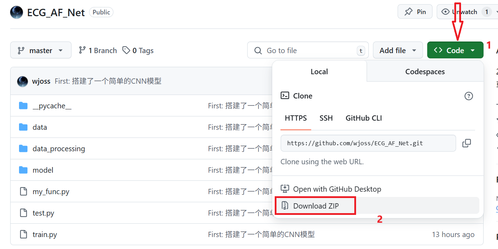
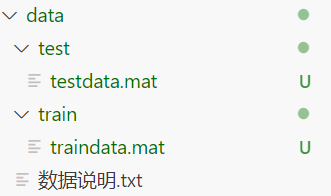
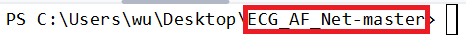
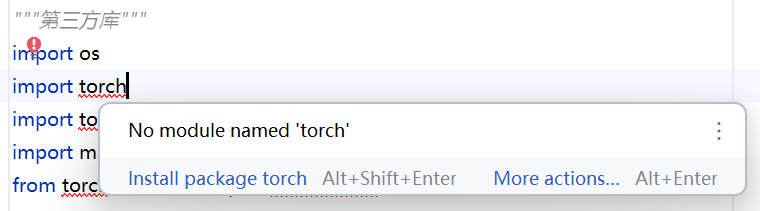

# CPSC2025

### 一个简单的CNN模型

#### 1. 下载zip文件并解压



#### 2. 下载数据集

由于github限制文件不能超过100MB，所以数据集需要自行下载，数据网址：

```
https://pan.baidu.com/s/1VW5egNuh3_cb5oKy9GsJsw?pwd=cpsc
```

下载后将`traindata.mat`文件放入`./data/train`目录下，将`testdata.mat`文件放入`./data/test目录下`




#### 3. 环境

准备工作完成后，进入`ECG_AF_Net-master`目录

必须要在`ECG_AF_Net-master`目录下！！！



确保你的电脑安装了`pyhton`

同时可能需要安装一些第三方包，比如`torch` 、`h5py`等，根据报错下载缺失的库（最好使用国内镜像源，速度更快，格式：`pip install 包名 -i https://pypi.tuna.tsinghua.edu.cn/simple`）



```bash
# 例如下载torch库与h5py库
pip install torch -i https://pypi.tuna.tsinghua.edu.cn/simple
pip install h5py -i https://pypi.tuna.tsinghua.edu.cn/simple
```

#### 4. 运行

最后直接运行`train.py`文件，自动创建`save`文件夹保存最佳模型，同时弹出损失曲线与准确率曲线图像

```bash
python train.py
```

